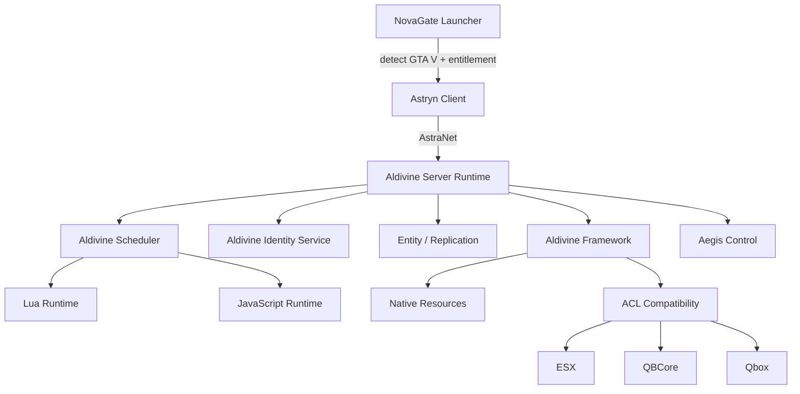
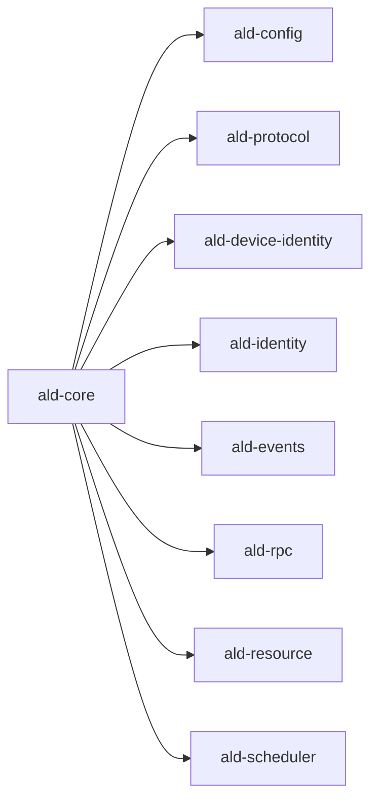

# ALDIVINE Architecture

Aldivine is an independent, Rust-native multiplayer platform for legitimate GTA V owners.
It does **not** require FiveM to run. FiveM is neither launcher, runtime, network bridge,
server, framework, nor a requirement for Native Mode.

## Subsystem Map

| Component | Role | Status |
|-----------|------|--------|
| NovaGate Launcher | GTA V detection, entitlement status, runtime update | PLANNED |
| Astryn Client | Native multiplayer runtime (bootstrap, net, scripts, resources) | PLANNED |
| Aldivine Server Runtime | Headless server, resource mgr, identity, replication | PARTIAL (core crates) |
| AstraNet | Hybrid transport (QUIC streams/datagrams, UDP) + firewall | PARTIAL (protocol framing) |
| Aldivine Framework | Service-oriented native framework (Players, Inventory, Economy...) | PARTIAL (identity/types) |
| ACL (Compatibility Layer) | ESX / QBCore / Qbox adapters | PLANNED |
| Aegis Control | Admin/orchestration backend + React frontend | PLANNED |
| Aldivine Scheduler | Workload-classified, budgeted, runaway-detecting scheduler | PARTIAL (policy engine) |
| Aldivine Identity Service | Platform-level identity aggregation + device id | PARTIAL |

## Runtime Flow

## Key Architectural Decisions

- **Language**: stable Rust, Cargo workspace, Tokio async, Rayon / custom work-stealing for parallel-safe work.
- **Database**: PostgreSQL (SQLite for local dev). Not depending on Redis.
- **Serialization**: Serde + length-prefixed JSON for events; binary AstraNet framing for packets
  (benchmark MessagePack/Protobuf/FlatBuffers before finalizing bulk payloads).
- **Isolation**: each resource runs in a capability-scoped context; unknown capabilities are rejected.
- **Scheduler**: per-resource budgets + runaway detection; not everything runs on the main thread.
- **Identity**: AldivinePlayerId (ULID) is the primary key; Steam/RS/Epic/Device are linked identities.
- **Privacy**: raw hardware serials never leave the device-identity crate or reach scripts/admins.
- **No GPU assumption**: CPU-bound gameplay/networking stays on CPU; GPU only for suitable batch workloads.

## Crate Layout

See ROADMAP.md and IMPLEMENTATION_STATUS.md for phase tracking.
